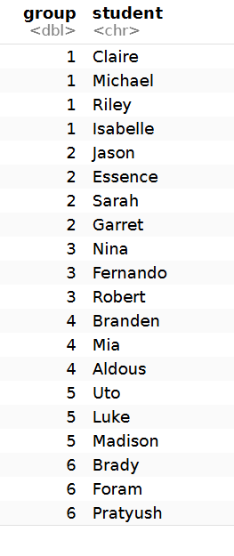
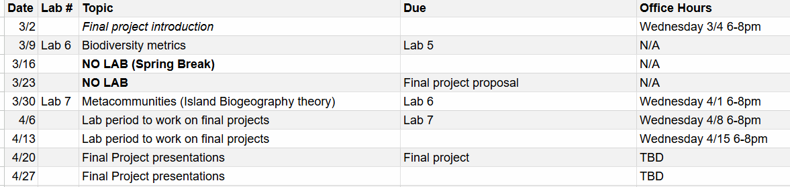

```{r}

rm(list = ls())

library(dplyr)


```

In your final project, you will be taking what you have learned throughout the semester to find a real-world dataset(s), analyze the data using R, discuss your findings using the concepts from lecture, and publish your analysis online that you can use to show your capabilities in R and ecological data science!\

### Logistics

You will be in groups of 3-4. You will all work together via GitHub, so choose one person's repo you will all work from. However, at the end of the project, be sure to paste this work into your own repo so you can share it with others.

```{r}


students_random <- c("Claire", "Jason", "Nina", "Branden", "Uto", "Brady", "Michael", "Essence", "Fernando", "Mia", "Luke", "Foram", "Riley", "Sarah", "Robert", "Aldous", "Madison", "Pratyush", "Isabelle", "Garret")

groups <- c(rep(1:6, 3), 1, 2)

final_project_groups <- data.frame(
  group = groups,
  student = students_random
)

final_project_groups <- final_project_groups %>%
  arrange(group)


```

{width="135"}

For your final project presentation, your group will go through your webpage in front of the class, talking through your data analysis workflow and findings.

You will also get class time to work together while troubleshooting with me, but should plan to meet in-person and/or via Zoom with your group outside of class.



Final project proposals will be due before 3:30pm on 3/23

Your group will be randomly chosen to present either on 4/20 or 4/27, so all presentations are due 4/20 before lab.\

Your final project grade will consist of:

-   5% project proposal (scored as a group)

-   10% on presentation (scored individually)

-   75% on project (scored as a group)

-   20% on peer assessment (scored individually)\

## Project Proposal

\<group_name\>\_project_proposal.qmd file pushed to your shared ghpages branch and should consist of:

-   Group name

-   Group member names and tentative roles (which parts of the analysis they will be leading, which parts of the presentation they will be leading)

-   Dataset(s) uploaded with description\
    You can address things like: *description of dataset(s) and studies they came from, pros and drawbacks of datasets, any assumptions you predict, etc.*

-   Some initial exploration of data with notes about cleaning that will be required, including how datasets may need to be joined\

## Final Project

Similar to labs and your homework assignments, in general you will alternate between analyzing/plotting real-world data, setting up a model, and then ***discussing*** if your model matches your data and what that implies **ecologically**.

You will need to find a dataset or combine multiple datasets (see the [join section](https://charleslehnen.github.io/BISC_404_Ecology_and_Biodiversity/Labs/Lab_4/cleaning_data_tips.html#combining-datasets) on the [data cleaning handout](https://charleslehnen.github.io/BISC_404_Ecology_and_Biodiversity/Labs/Lab_4/cleaning_data_tips.html)) so that your dataset meets these requirements:

1.  Count data (or each row is an individual)

2.  Multiple timepoints (at least 100)

3.  At least 3 species (at least one species should likely consume another one of your species) over the same time period in the same area

4.  Data collected at at least 2 sites

Here is what you will do in your R script after choose **3-4 focal species** and their interactions to focus on.

0\) Set-up your environment, describe your dataset in detail, load in dataset, explore raw dataset, clean data while describing cleaning process, etc.

1\) Assess **population growth** patterns of 3 individual species\
You can address questions like: *Is population growth continuous or discrete? Ignoring interactions with other species, does it seem like population growth is exponential or logistic?*

2\) Assess **predation** between 3-4 focal species\
You can address questions like: *Does it look like predation is happening? If so, which type of functional response? Is Lotka-Volterra or Rosenzweig-MacArthur better for modeling predation in your system?*

4\) Assess interspecies **competition** between 3-4 focal species\
You can address questions like: *Does the Lotka-Voltera Interspecific Competition Model indicate competition in your system? What about zero-growth isoclines?*

5\) Assess **biodiversity** in your system and between your sites\
You can address questions like: *What is the alpha diversity of your sites? Gamma diversity? Which method(s) of beta diversity analysis would best fit your system? What is the beta diversity in your system? What do abundance distance metrics tell you about your system? How does that compare with NMDS? How do richness measures compare to abundance measures in your system?* *Which "Diversity Index(ices)" is best for your system? What do these indices tell you??*

6\) Overall, clear conclusions and discussion about your findings\
You can also address questions like: *How do your results/conclusions compare to those of the original authors of your dataset? How would you expand on data collection or analysis as next steps in this analysis?*

6+) References\

\*\*NOTE whenever you use models or conduct analyses, you are making assumptions. Please clearly state the assumptions you are making (*e.g. when doing the population growth analyses you will be assuming species are not influencing one another's population growth patterns*) throughout your project
