## Publishing .qmd Rendered Webpage to GitHub Pages

GitHub Pages allows you to host webpages or webapps online for free! *Note that this will create a public branch in your repo (anyone can see your ghpages branch) so keep that in mind.*

### Creating a branch

First we will branch our repo. A branch is an alternative copy of your repo. They are often used to test experimental changes before including them in the main branch, for working with teams so that people can work on different functionality without causing problems for one another, or (in our case) hosting.\
\
In the latter two cases, you would submit a "pull request" to pull changes from your branch into the main branch. In software development teams, senior programmers spend a lot of their time reviewing and accepting/rejecting pull requests made by team members. In those situations, your branch would start as a copy of the main branch. Because of that, making a copy of the main branch and all of its commit history is the default when you add a new branch in GitHub.

We want to start with an empty branch which is not the default, so we will have to do that in the Git Bash command line:

1.  Open Git Bash

2.  cd (change directory) to navigate to your repo by typing in its path (*Tip: remember using tab for autocomplete helps with speed but, more importantly, makes sure you don't have any spelling errors*)

    -   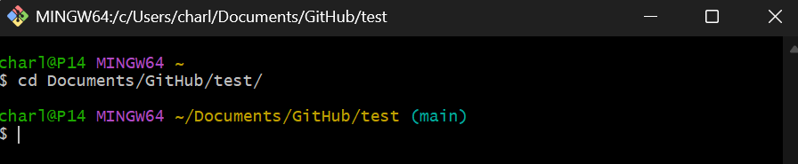{width="514"}

3.  Now create an "orphan" branch (a branch with no commit history) named "ghpages"

    -   `git switch --orphan ghpages`

4.  Open GitHub Desktop and you will notice that "current branch" has changed and we no longer see our Git history. From now on since you now have more than one branch, you will need to be cognizant about which branch you are committing/pushing/pulling/etc. from. We cannot "Publish Branch" yet because there are no commits on our branch.

    -   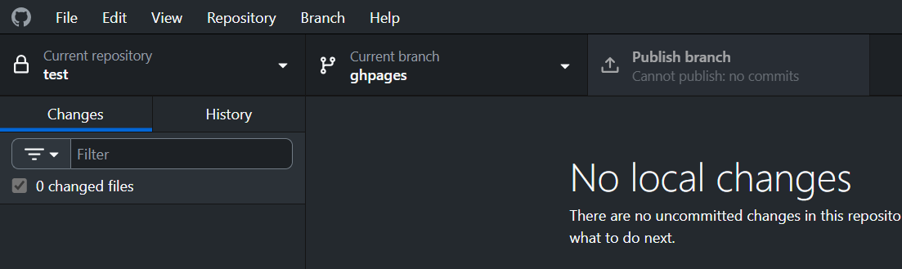{width="520"}

5.  Open Rstudio, use the files viewer to navigate to your repo (It *should* look empty, so do not panic! That is because you are on a different branch. When you switch back to your main branch on GitHub Desktop your files will magically reappear). Create a .qmd file named "index.qmd"

    -   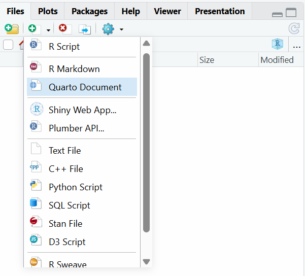{width="218"}

    -   (*Remember that a .qmd file is just a fancy version of a markdown file (like your README.md file) that is a filetype made by the same company that made RStudio (Posit))*

6.  Type something into your "index.qmd" file (feel free to play with some markdown formatting, or put in images, whatever. Just like you have been practicing all semester long!)

7.  Edit the `format` section in the YAML block (*see below for more info*) at the top of your document to match this for now:

```         
format: 
  html:
    self-contained: true
    toc: true
  pdf: default
```

8.  Click Render \> Render HTML or Check the "Render on Save" box then save. This will render your page as html! Without you having to write any actual html/css.

    -   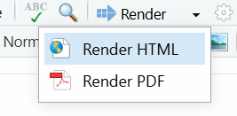{width="153"}
    -   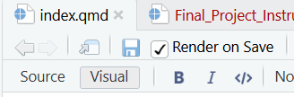{width="186"}

9.  Now commit and publish via GitHub Desktop

### Publishing Publicly via GitHub Pages

In GitHub go to Settings \> Pages

-   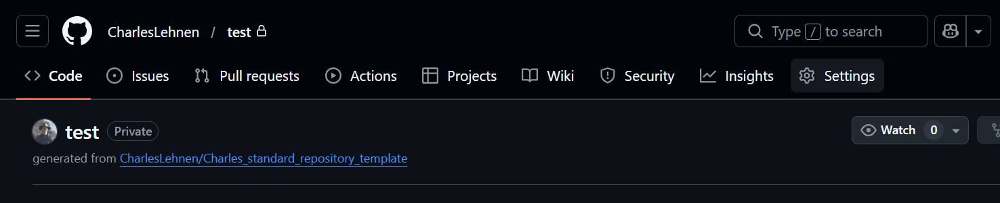{width="464"}

-   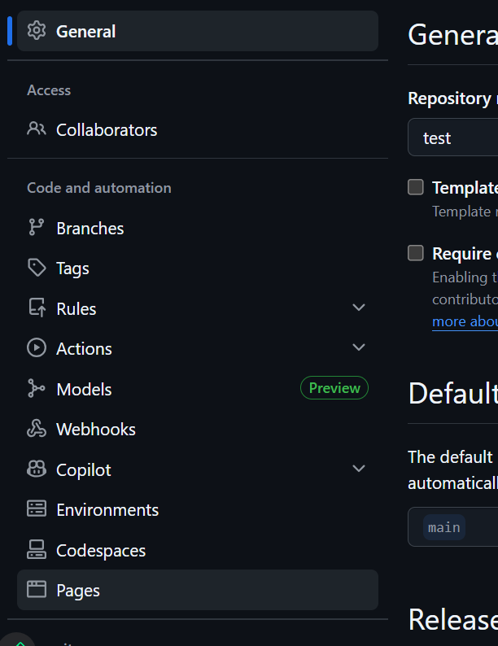{width="160"}

Select your new "ghpages" branch and hit save

-   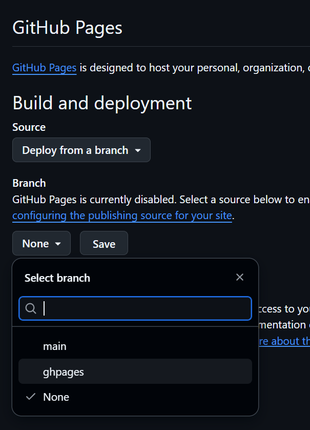{width="162"}

Refresh and navigate to your website!

-   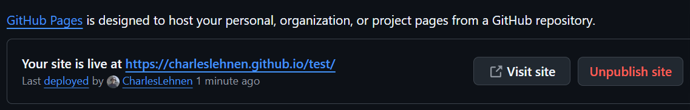{width="569"}

This is a public website! On the internet! So share your URL with your neighbor and watch that they can visit your webpage too

(*Note, you can add a custom URL/domain name for ghpages. The hosting is free, but you will have to pay annually for the custom domain name.*)

### YAML Configuration

Be sure to edit your YAML block! Feel free to copy the YAML block from any handouts/assignments form this course to help you get started.

YAML staynds for "YAML Ain't Markup Language." Originally, it stood for "Yet Another Markup Language." It is used for configuration. In our case, it is telling R how to render html from our .qmd file.

Be sure to edit:

-   Author

-   Theme (options can be found [here](https://quarto.org/docs/output-formats/html-themes.html))

-   Bibliography (you will need to make your own .bib file)

#### Bibliography

To create a bibliography:

1.  Create a .bib file (be sure to point your YAML to the correct name/location of your file)

2.  Find BibTeX format citations (BibTeX is a reference format in LaTeX, which you have seen throughout the semester whenever equations are written in our .qmd files)

    -   Find source on Google Scholar, click Cite, and select BibTeX:
        -   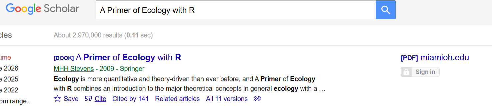{width="407"}
        -   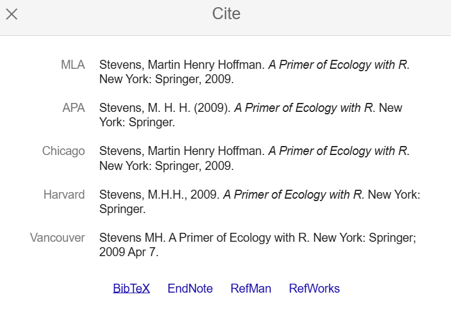{width="227"}
        -   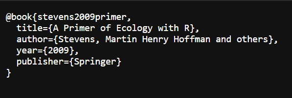{width="343"}

3.  Paste your BibTeX citations into your .bib file:

    -   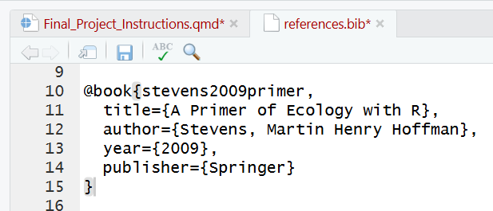{width="375"}

4.  In source mode, add the following at the bottom of your document:

    -   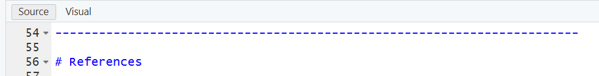{width="414" height="52"}

------------------------------------------------------------------------

# References
